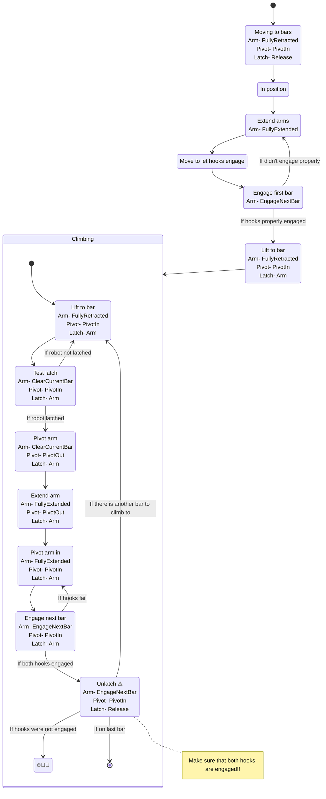

# Climber states

## Arm target positions

* FullyRetracted
* ClearCurrentBar
* FullyExtended
* EngageNextBar

## Pivot states

* PivotIn
* PivotOut

## Latch states

* Arm
* Release

```mermaid
stateDiagram-v2
    moving: Moving to bars <br> Arm- FullyRetracted <br> Pivot- PivotIn <br> Latch- Release
    grounded: In position
    initial_extend: Extend arms <br> Arm- FullyExtended
    move_to_engage: Move to let hooks engage
    initial_extend_verify: Engage first bar <br> Arm- EngageNextBar
    first_lift: Lift to bar <br> Arm- FullyRetracted <br> Pivot- PivotIn <br> Latch- Arm

    [*] --> moving
    moving --> grounded

    %% We are positioned at the monkey bars at this point
    grounded --> initial_extend
    initial_extend --> move_to_engage
    move_to_engage --> initial_extend_verify
    initial_extend_verify --> initial_extend : If didn't engage properly

    %% We're on the first bar, time to pull up!
    initial_extend_verify --> first_lift : If hooks properly engaged
    first_lift --> Climbing

    %% Climbing cycle
    state Climbing {
        lift: Lift to bar <br> Arm- FullyRetracted <br> Pivot- PivotIn <br> Latch- Arm
        test_latch: Test latch <br> Arm- ClearCurrentBar <br> Pivot- PivotIn <br> Latch- Arm
        pivot: Pivot arm <br> Arm- ClearCurrentBar <br> Pivot- PivotOut <br> Latch- Arm
        extend: Extend arm <br> Arm- FullyExtended <br> Pivot- PivotOut <br> Latch- Arm
        unpivot: Pivot arm in <br> Arm- FullyExtended <br> Pivot- PivotIn <br> Latch- Arm
        engage_bar: Engage next bar <br> Arm- EngageNextBar <br> Pivot- PivotIn <br> Latch- Arm
        unlatch: Unlatch ⚠ <br> Arm- EngageNextBar <br> Pivot- PivotIn <br> Latch- Release
        disaster: 🔥🚒🧯

        [*] --> lift
        lift --> test_latch
        test_latch --> lift : If robot not latched
        test_latch --> pivot : If robot latched
        pivot --> extend
        extend --> unpivot
        unpivot --> engage_bar
        engage_bar --> unpivot : If hooks fail

        note right of unlatch : Make sure that both hooks are engaged!!
        engage_bar --> unlatch : If both hooks engaged
        unlatch --> lift : If there is another bar to climb to
        unlatch --> disaster : If hooks were not engaged
        unlatch --> [*] : If on last bar

    }
```