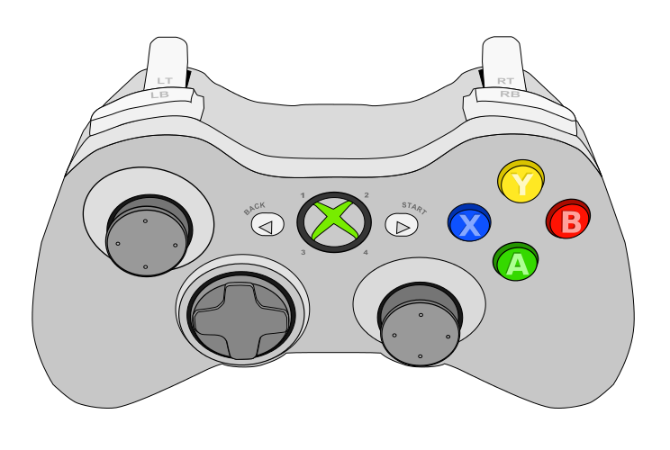

# Driving the Robot

The robot is driven using two XBox One controllers - one for the driver and one for the operator. The driver will generally control the position of the robot on the field, while the operator will generally operate other robot functions (i.e. climber).

## Getting Started

Drive around with the **left / right joysticks** from the **driver gamepad**.

In order to operate the **climber arms**, you need to calibrate it first. From the **operator gamepad**, enter **unsafe mode** with **X** and slowly use the **left / right joysticks** to bring the arms to their lowest position. Press **Y** to calibrate the arms, and then press **B** to enter maintainer mode.

In order to unlatch the climber hooks, the **driver** must press **left / right triggers** and the **operator** must press the **back** button simultaneously. If you don't have two controllers, you can use **SmartDashboard** to unlatch the climber hooks. The latch will re-latch automatically.

## Driver Gamepad

**Gamepad ID:** 0

| Command | Button |
| :-- | :-- |
| Move (translate) | Left joystick X+Y |
| Move (absolute rotation) | Right joystick |
| Move (relative rotation) | Left / Right Trigger |
| Rotate to vision target | Right bumper |
| Unlatch | Start (with operator) |
| Retract collector | B |

## Operator Gamepad

**Gamepad ID:** 1

| Command | Button |
| :-- | :-- |
| Collector intake | Right trigger |
| Collector eject | Left trigger |
| Unlatch | Start (with driver) |
| Conveyor eject | D-pad Up |
| Conveyor forward | D-pad Left/Right/Down |
| Shooter speed low (vision) | B (hold) |
| Shooter speed high (vision) | Y (hold) |
| Shooter speed low | X (hold) |
| Shooter speed high | A (hold) |
| Shoot | Back |
| Pivot arm out | Left bumper |
| Pivot arm in | Right bumper |
| Set arms calibrated | Left stick (press) |
| Disable arm limits | Right stick (press) |
| Extend / retract arms | Left / right stick |

## SmartDashboard commands

* Unlatch (without two person override, no timeout)
* Latch
